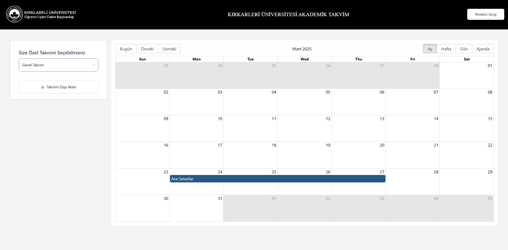
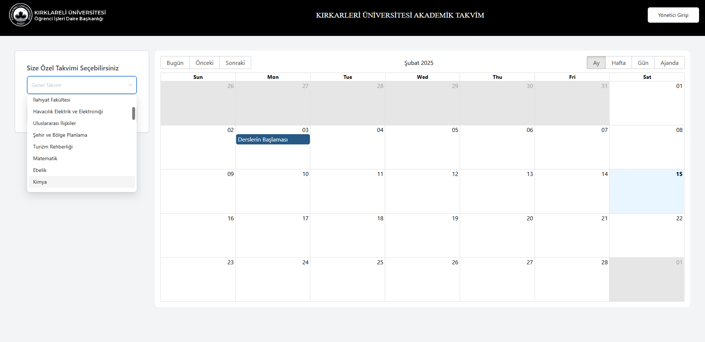
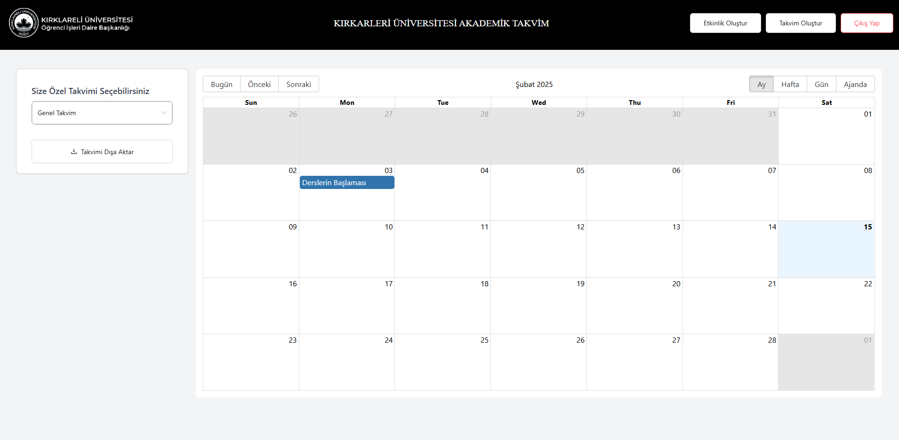
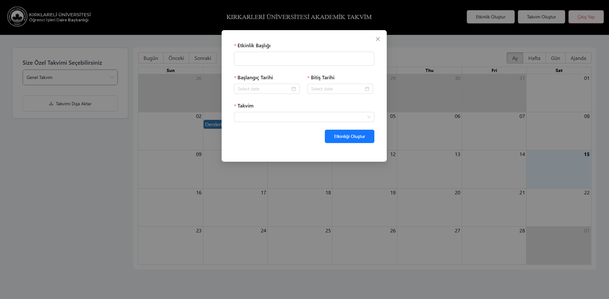
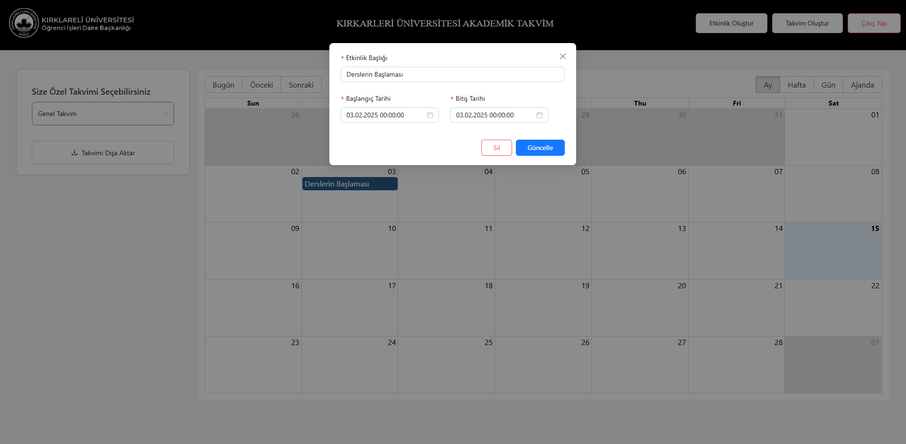

# 🎓 Kırklareli University Academic Calendar

This project is a web application developed for managing and viewing the academic calendar of Kırklareli University. Administrators can add and manage events, while students can view the general or department-specific calendars.

## 🚀 Technologies Used

- **Frontend:** React, Vite, Tailwind CSS  
- **Backend:** Express.js, Node.js  
- **Database:** PostgreSQL / MongoDB (Specify the database used)  
- **Authentication:** Clerk  

## 📌 Features

### 🎯 For Administrators:
- 🔐 Secure login to access the admin panel
- 📅 Add new academic calendars
- 📝 Add and manage events
- ✏️ Update existing events
- 🗑️ Delete events


### 🎯 For Students:
- 📌 View the general academic calendar
- 📚 Access department-specific calendars
- 📤 Export calendar data (if applicable)

## ⚡ Installation and Setup

1. **Clone the repository:**
   ```bash
   git clone https://github.com/bkaratas/university-academic-calender.git
   cd university-academic-calender
   ```

2. **Install dependencies:**
   ```bash
   npm install
   ```

3. **Run the application:**
   ```bash
   npm run dev
   ```
   This command starts both the frontend and backend simultaneously.

## 📷 Screenshots








